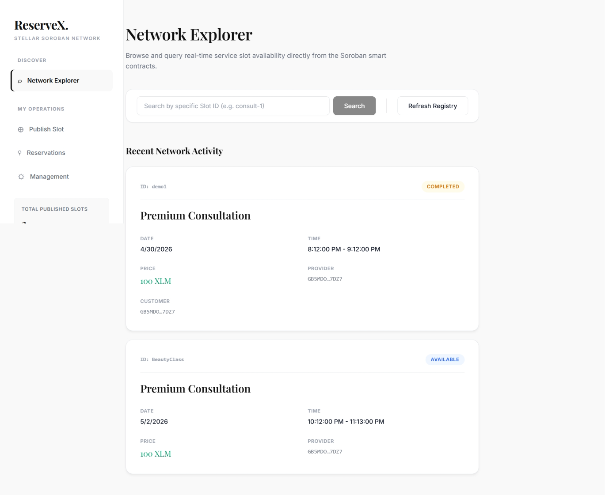
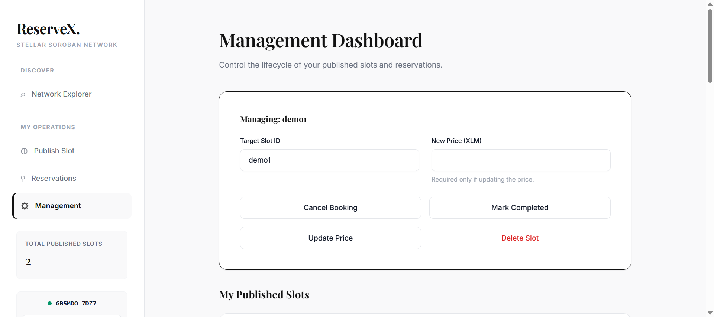
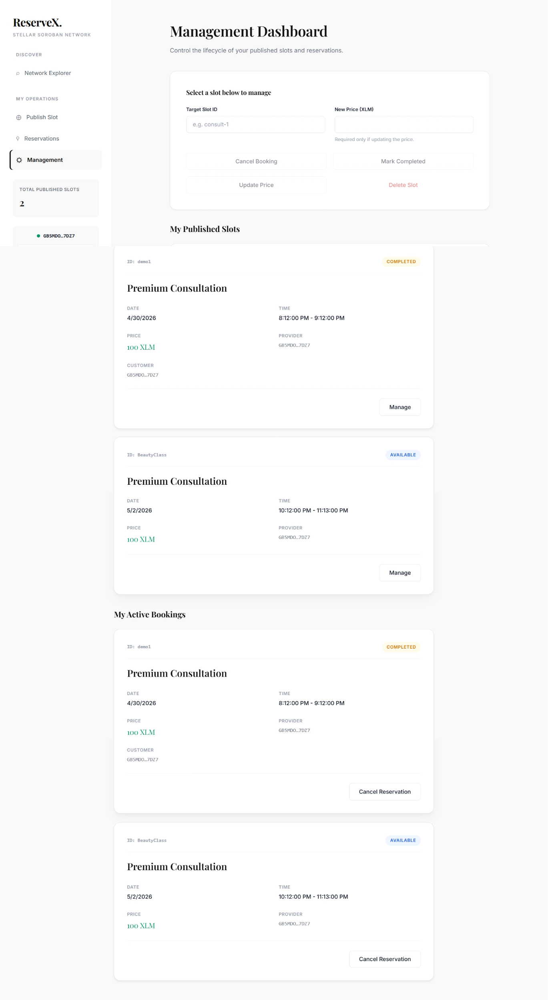
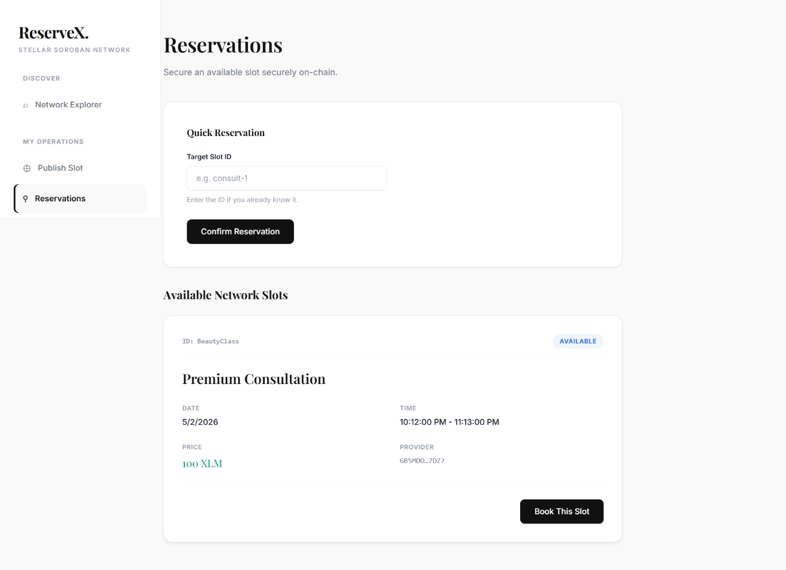
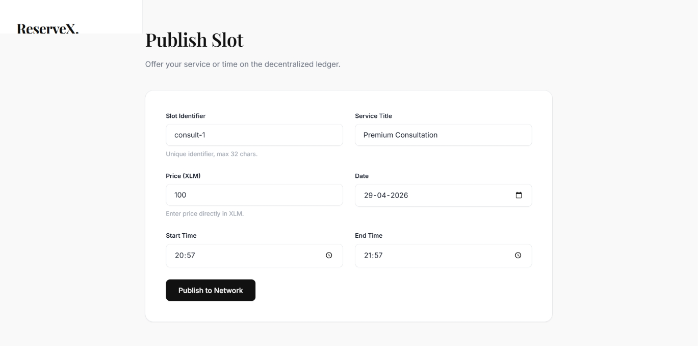
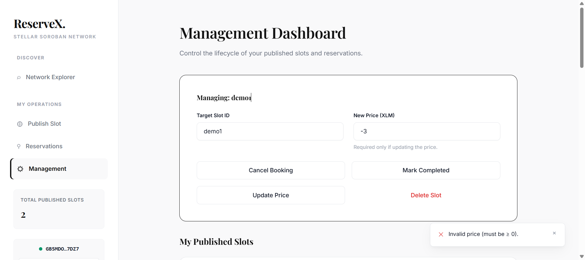
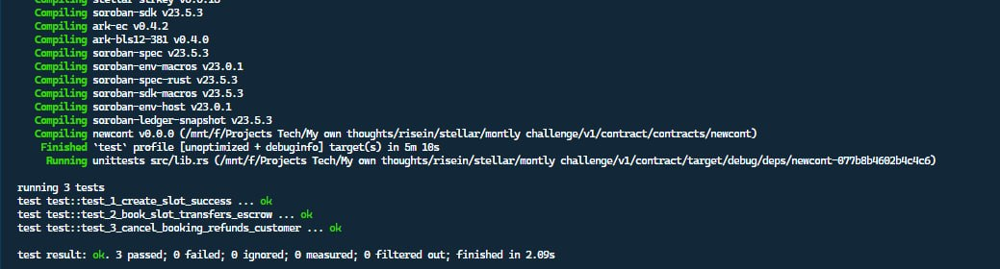

# 🌟 ReserveX: Decentralized Booking & Reservation Network

ReserveX is a premium, production-ready decentralized application (dApp) built on the Stellar Soroban network. It empowers service providers to offer their time and services securely on-chain, while allowing customers to book these services through a trustless XLM token escrow system. 

By removing traditional intermediaries, ReserveX ensures absolute transparency, instant settlement, and zero middleman fees.

## 📖 Project Overview & Vision

In traditional service booking platforms (like Calendly, Upwork, or Airbnb), intermediaries control the data, take significant percentages of the transaction, and hold the power to delay payouts. 

**ReserveX solves this by utilizing the Stellar Network to create a fully decentralized marketplace:**
*   **For Providers:** You own your data. You publish a slot directly to the ledger. Once your service is booked, the funds are cryptographically guaranteed in escrow. When the service is complete, the funds are instantly released to your wallet without multi-day banking delays.
*   **For Customers:** You get verifiable proof of your reservation. If a service is canceled by the provider, the smart contract logic dictates an automatic, immediate refund—no customer support tickets required.

## 🔗 Quick Links

- **Live DApp:** [ReserveX on Vercel](https://reserve-x-woad.vercel.app/)
- **Demo Video:** [Watch the 1-minute full functionality demo](https://youtu.be/19m54yecDf4)

---

## 🚀 Key Functionalities & Tokenomics

ReserveX isn't just a prototype; it features a robust, production-grade tokenomic workflow relying on the native XLM token.

1. **Decentralized Service Registry:** Providers publish bookable time slots (with specific Start Times, End Times, and XLM Prices) directly to the Soroban smart contract.
2. **Trustless XLM Escrow Tokens:** When a customer clicks "Book", their Freighter wallet signs a transaction that securely locks the exact XLM price into the smart contract's escrow balance.
3. **Lifecycle Management & Settlement:** 
   - *Complete:* Providers release the XLM to their own wallet by marking a booking as "Completed".
   - *Cancel:* If either party cancels the reservation, the XLM is instantly refunded to the customer.
   - *Update/Delete:* Unbooked slots can be freely modified or deleted by the provider.
4. **Network Explorer Dashboard:** A fully functional, responsive interface to browse real-time service slot availability across the network, categorized cleanly by active, booked, and available statuses.
5. **Real-time Status Tracking:** Custom UI Modals intercept successful blockchain transactions, providing users with direct links to view their receipt and trace on Stellar Expert.
6. **Robust Error Handling:** The smart contract surfaces 9 explicit error states (e.g., `InvalidTimeRange`, `AlreadyBooked`, `Unauthorized`) which are captured and presented via seamless Toast notifications to the frontend user.

---

## 🎨 Premium User Experience

The application was designed with a **"Premium Editorial White Mode"** design system. 
- Utilizes an elegant typography pairing (`Inter` for sans-serif UI elements, `Playfair Display` for sophisticated headers).
- Dynamic sticky sidebar navigation for intuitive workspace management.
- Abstracted crypto complexities: users see values in standard XLM rather than raw blockchain "stroops" (1 XLM = 10,000,000 stroops).

---

## 🖼️ Application Gallery

### 1. Application Dashboards & Workflow
*Explore the seamless, editorial-style sidebar navigation and complete lifecycle management workflow.*







### 2. Robust Error Handling 
*The UI captures and presents all 9 explicit Soroban smart contract error states.*



### 3. Smart Contract Test Output (3+ Passing Tests)
*Comprehensive testing for Slot Creation, Escrow Token Transfers, and Cancellation Refunds.*



---

## ⛓️ Technical Architecture & Contract Details

The Soroban smart contract is written in Rust and utilizes the `soroban_sdk::token::Client` to handle cross-contract calls to the Native Stellar Asset Contract. 

- **Network:** Stellar Testnet
- **ReserveX Contract ID:** `CDNVTLE2EBGAXHFFDDOJRT4RT7GDXI3G4ACWD3TYJ2KTTAOG7L2QTLOW`
- **Native XLM Token Address:** `CDLZFC3SYJYDZT7K67VZ75HPJVIEUVNIXF47ZG2FB2RMQQVU2HHGCYSC`
- **Example Transaction Links:**
  - [Contract Interaction (Booking/Escrow)](https://stellar.expert/explorer/testnet/tx/9868048139821056#9868048139821057)
  - [Operation Trace 1](https://stellar.expert/explorer/testnet/op/9868018075066369)
  - [Operation Trace 2](https://stellar.expert/explorer/testnet/op/9867992305266689)
  - [Operation Trace 3](https://stellar.expert/explorer/testnet/op/9867464024293377)

---

## 🛠️ Tech Stack

- **Frontend:** React.js, Vite, Vanilla CSS 
- **Blockchain Interface:** `@stellar/stellar-sdk`, `@stellar/freighter-api`
- **Smart Contract:** Rust (Soroban SDK)
- **Deployment:** Vercel (Frontend)

---

## 💻 Local Setup Instructions

Follow these steps to run the ReserveX environment on your local machine.

### Prerequisites
- Node.js (v16+)
- Freighter Browser Extension (configured for Stellar Testnet and funded via Friendbot)
- Rust & Soroban CLI (only if you wish to re-compile the contract)

### 1. Clone & Install
```bash
# Navigate to your project directory
cd "Stellar project/v1"

# Install frontend dependencies
npm install
```

### 2. Run the Development Server
```bash
# Start the Vite development server
npm run dev
```
The application will launch on `http://localhost:5173/` (or similar). Connect your Freighter wallet to begin interacting with the Testnet contract!

### 3. Run Soroban Tests
To verify the smart contract logic and tokenomics locally:
```bash
cd contract
cargo test
```
